# ChatGPT Prompts Organizer

A Chrome extension designed to streamline your ChatGPT experience by allowing you to organize, manage, and customize your prompts efficiently.


## 🧠 Overview

The ChatGPT Prompts Organizer enhances your interaction with ChatGPT by providing:

- **Folder Management**: Create, rename, update (including folder color), and delete folders to categorize your prompts.
- **Prompt Organization**: Add, remove, and organize prompts within folders.


## 🚀 Features

- **Folder Operations**:
  - Create new folders with custom names and colors.
  - Rename and update folder details including color.
  - Delete folders you no longer need.
- **Prompt Management**:
  - Add prompts into folders.
  - Delete prompts from folders.
  - Organize prompts efficiently.


## 🛠️ Installation

### 🔧 Manual Installation

1. Clone this repository:

   ```bash
   git clone https://github.com/drissboumlik/chatgpt-prompts-organizer.git
   ```
2. Open Chrome and navigate to chrome://extensions/.
3. Enable Developer mode (toggle switch on the top-right).
4. Click Load unpacked and select the cloned repository folder.


## 📸 Screenshots

### Creating folders

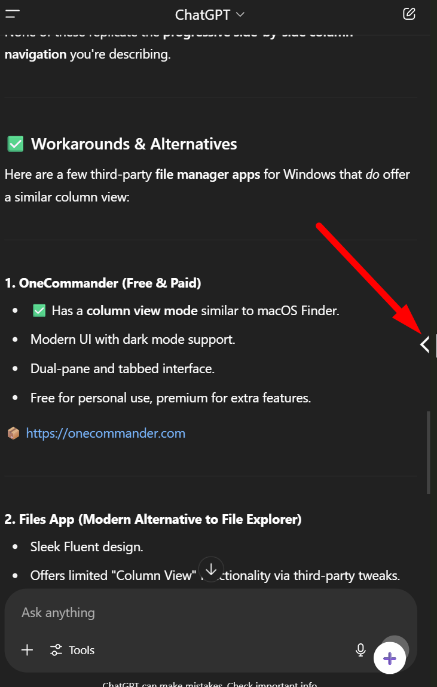
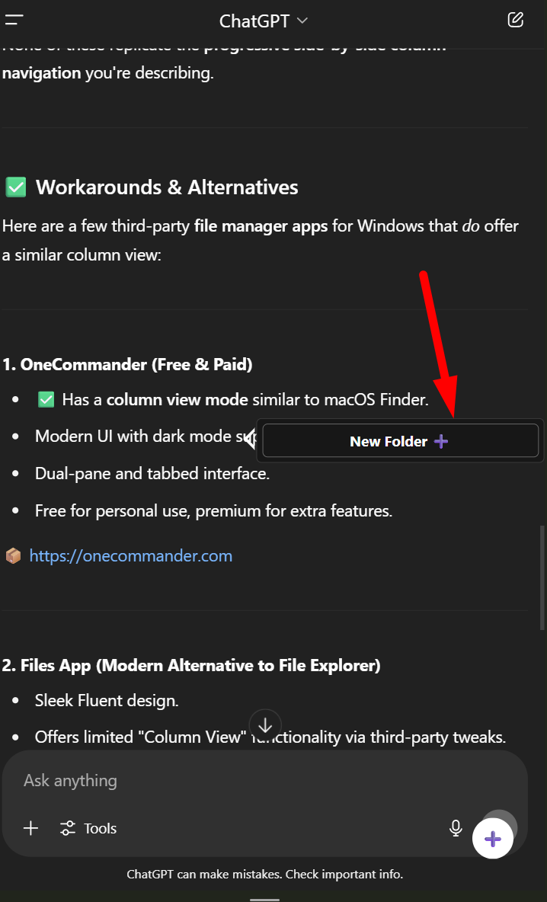
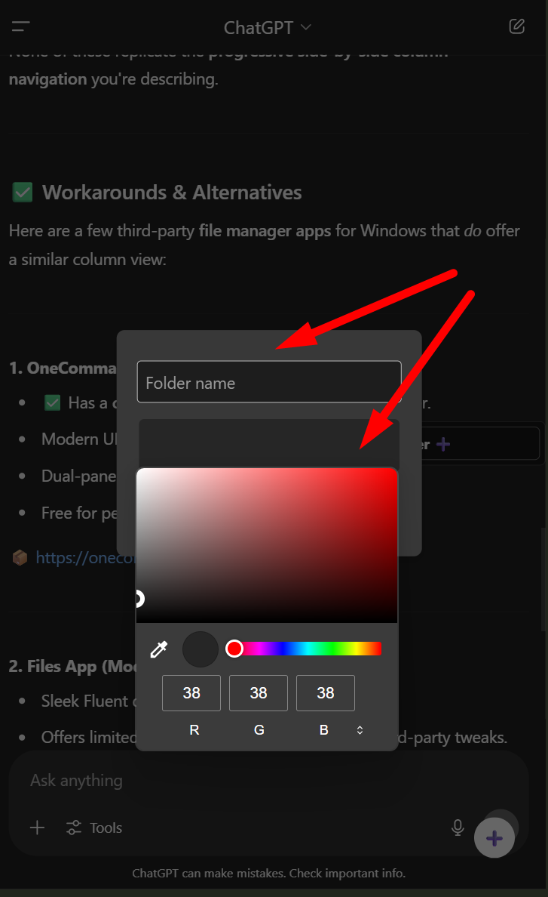
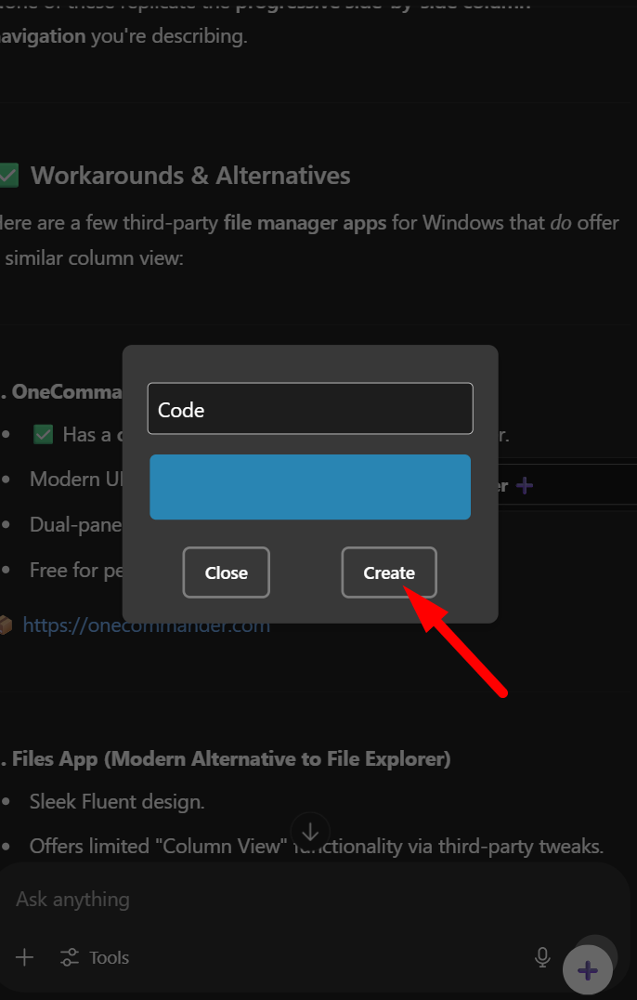
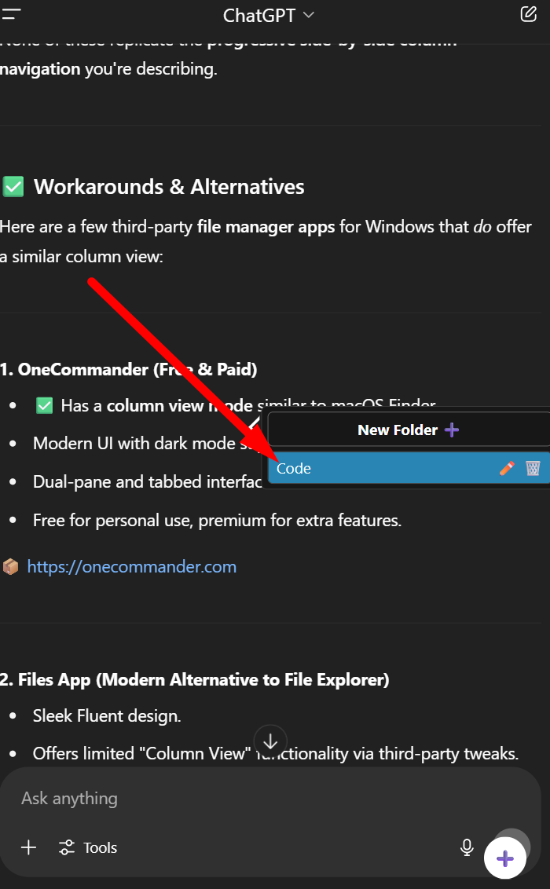
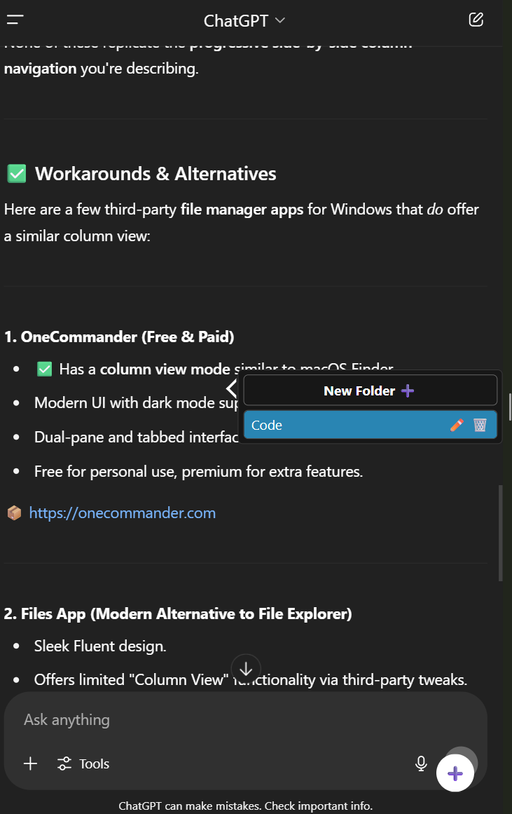

---

### Add prompts to folders from chatgpt sidebar

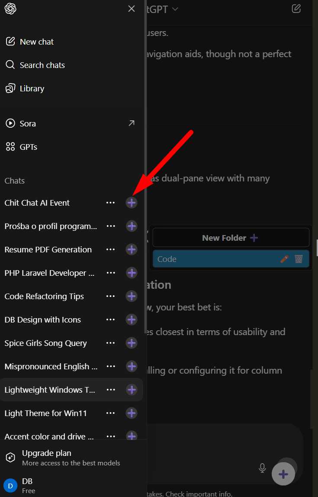
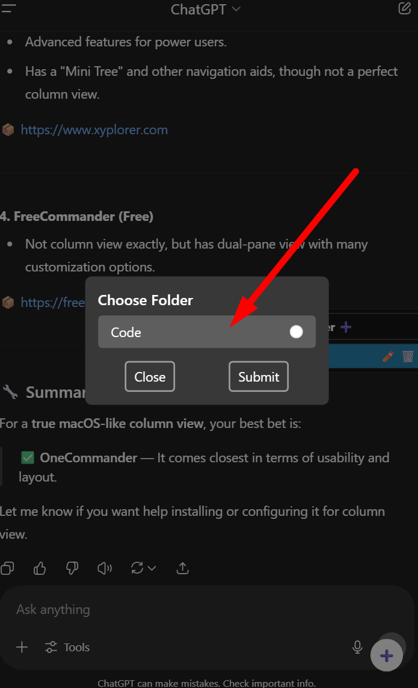
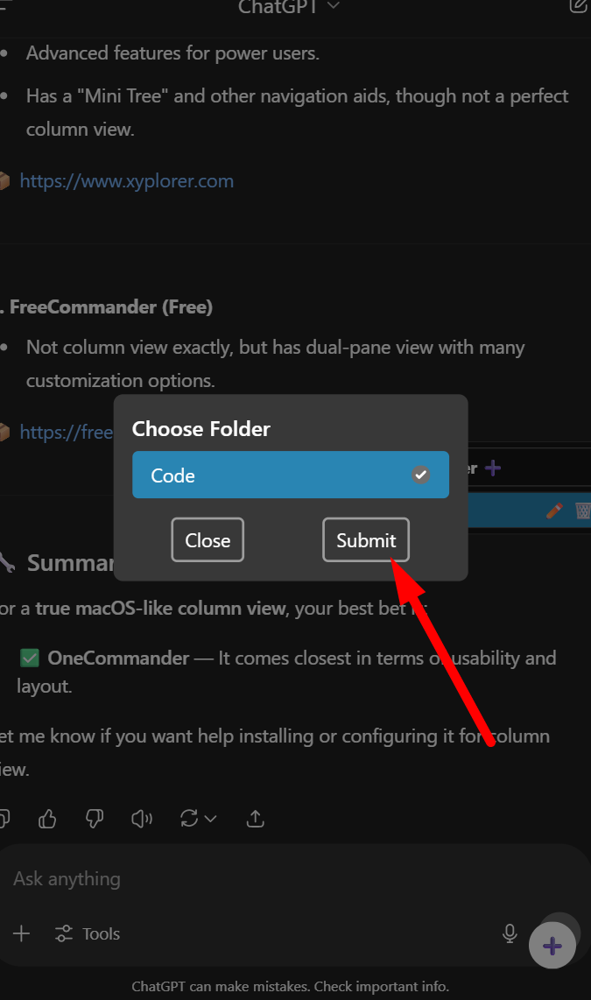
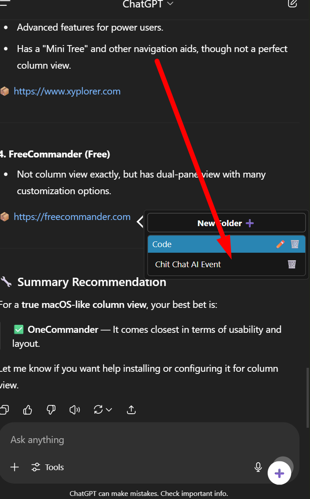

---

### Add current prompt to folders

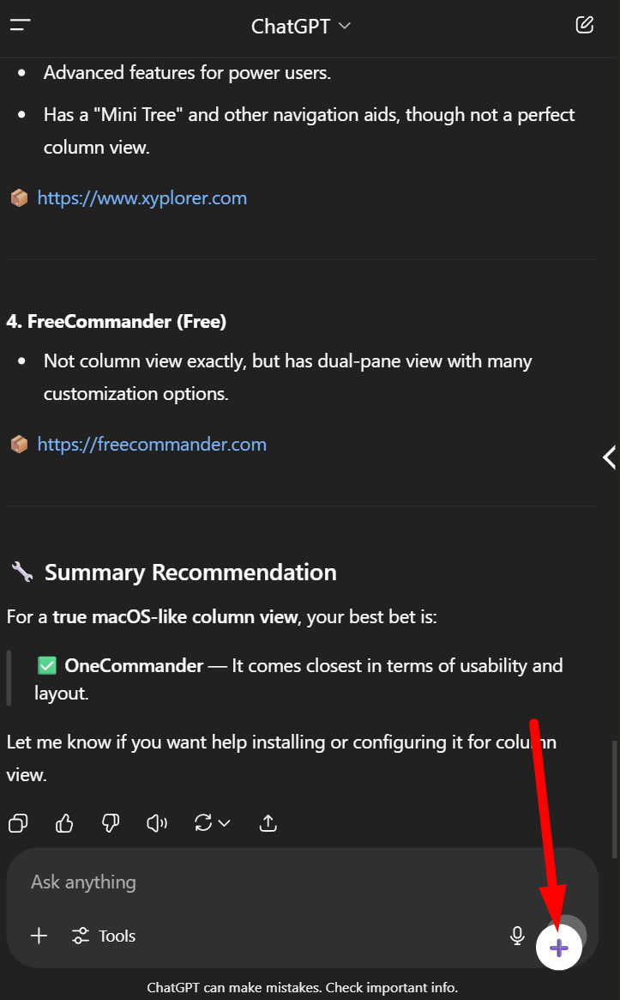
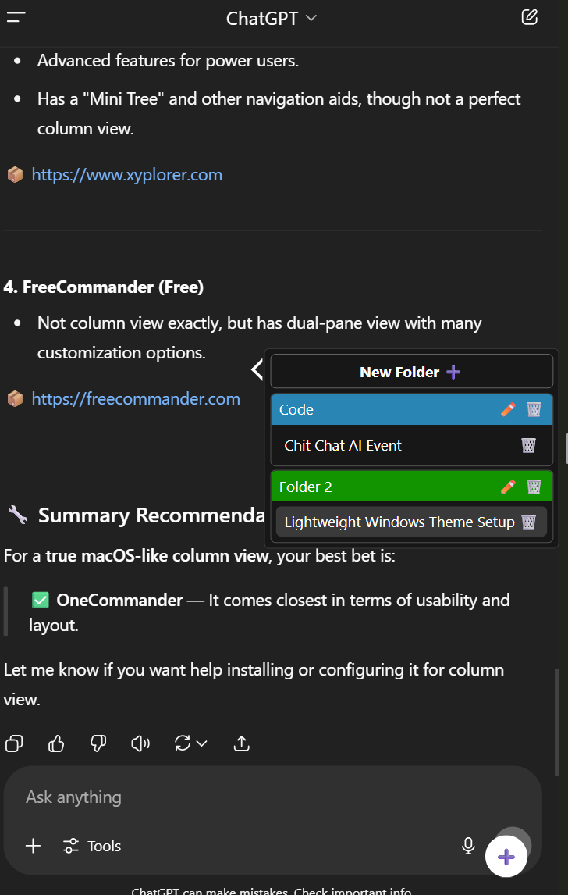

## 🤝 Contributing
Feel free to open issues or submit pull requests. Contributions are welcome!